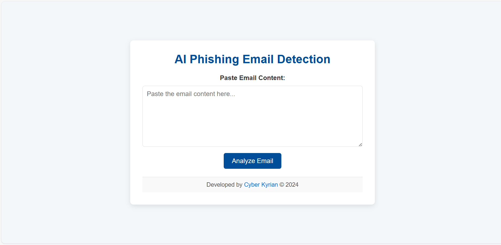

# 🛡️ Phishing Detection Web App (Demo)

### Author: Kyrian Onyeagusi

---

## Project Summary

This is a machine learning-powered web app that detects phishing emails and links. Built with cybersecurity in mind, it helps users assess the risk of suspicious content through a user-friendly interface.

**Note:** This public version is a **demonstration only**. Core detection logic and model files have been removed for security and IP protection. Full source available **upon request**.

---

## Features

* Predicts phishing likelihood from user-inputted content
* Web interface built using Streamlit
* Shows probability score with recommendation
* Powered by a trained ML model (not included here)

---

## Screenshots

> ✅ **App Interface**
> 

> ✅ **Prediction Result**
> 

---

## Security Purpose

This app is designed to:

* Help non-technical users identify phishing attempts
* Demonstrate real-world ML use in cybersecurity
* Provide a scalable foundation for integration with Gmail, Outlook, etc.

---

## Tech Stack

* Python 3.x
* Streamlit (frontend)
* scikit-learn (model training)
* joblib (model serialization)
* pandas, numpy

---

## 🔄 Future Features

* Gmail & Outlook integration using Google API / Microsoft Graph
* Email scanning automation with alerts
* Role-based dashboard for enterprise use

---

## 🔗 Live Demo / Request Access

**Live App**: \[Coming Soon]
**Contact**: [cyberkyrian@gmail.com](mailto:cyberkyrian@gmail.com)
